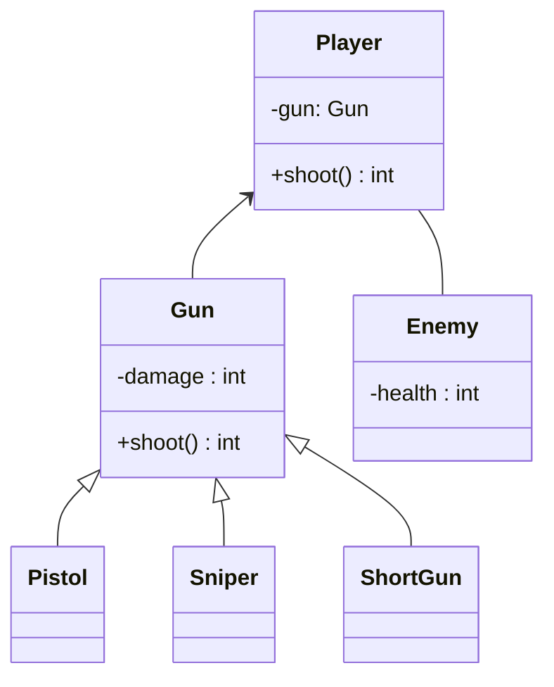

There is a player and he has different kinds of guns
Based on the type of the gun damage is delt
player can chose the type of gun he wants to use for every round

```mermaid
classDiagram
    Gun <|-- Pistol
    Gun <|-- Sniper
    Gun <|-- ShortGun
    Player <-- Gun
    Player -- Enemy

    class Player {
        -gun: Gun
        +shoot() int
    }

    class Enemy{
        -health : int
    }

    class Gun{
        -damage : int
        +shoot() int
    }

    class Pistol{

    }
    class Sniper{

    }
    class ShortGun{

    }


```
