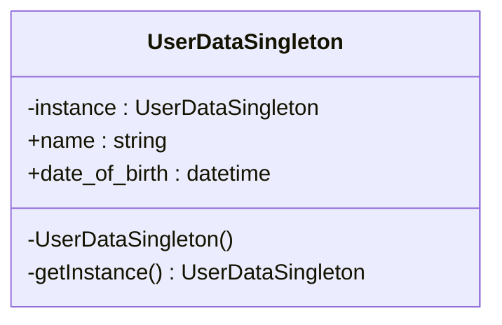

```mermaid
classDiagram
    class UserDataSingleton{
        -instance : UserDataSingleton
        +name : string
        +date_of_birth : datetime
        -UserDataSingleton()
        -getInstance() UserDataSingleton
    }
```
